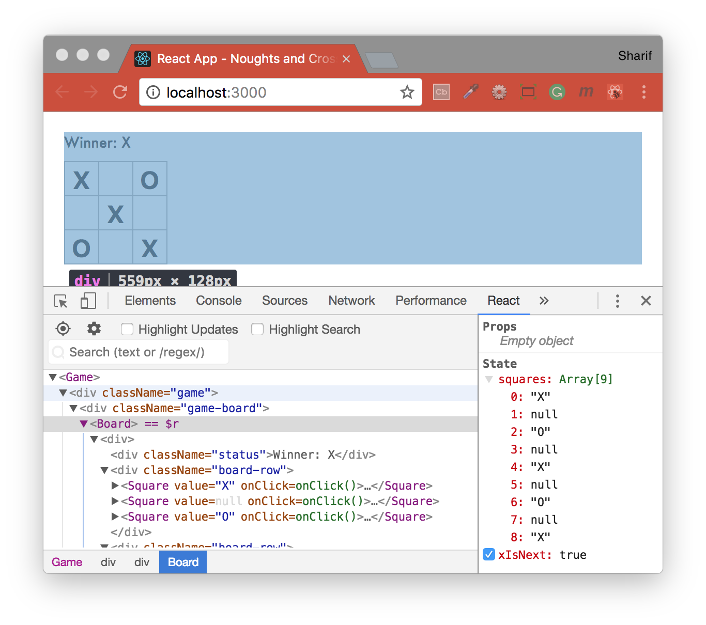
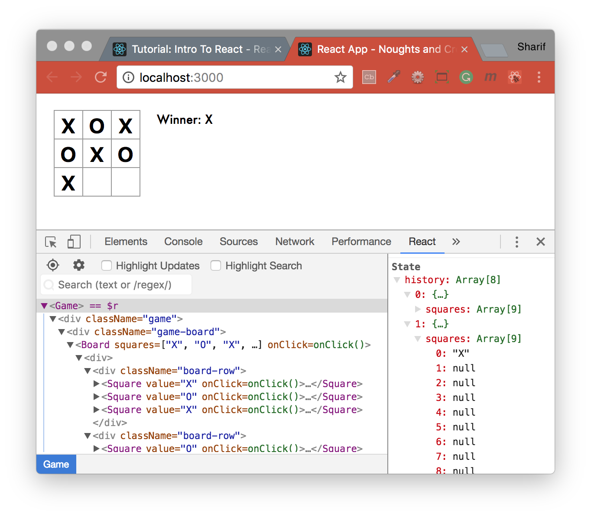
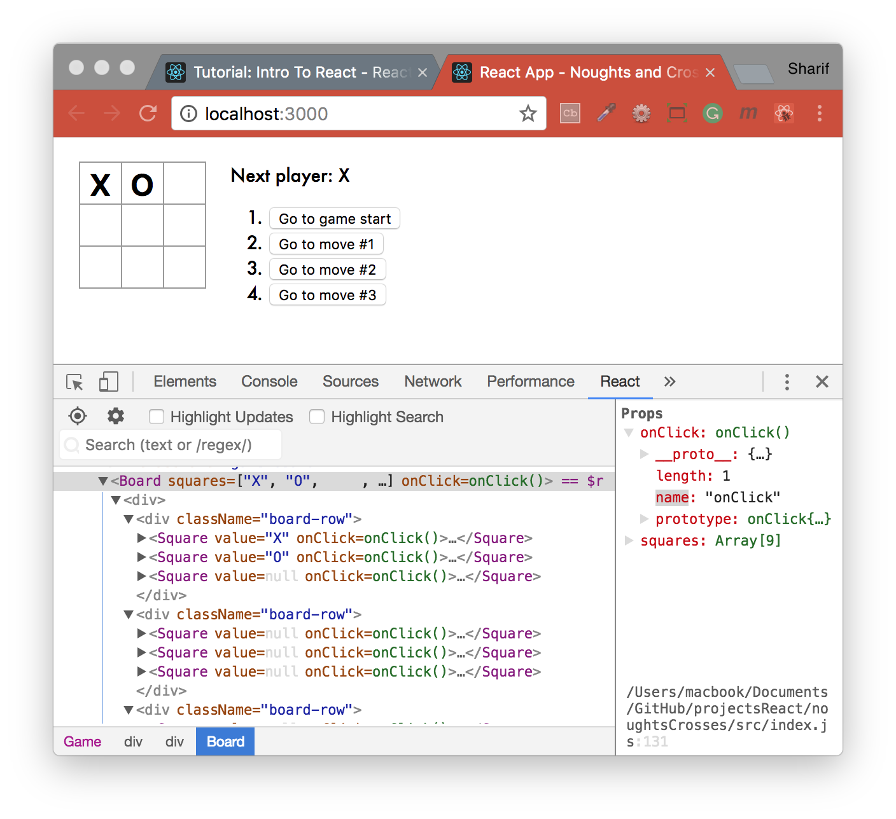

## Noughts & Crosses with React
This react app is a version of the noughts and crosses (tic tac toe) game, followed via the [Tutorial: Intro To React](https://reactjs.org/tutorial/tutorial.html).

To play the game online click [here](https://codepen.io/gaearon/pen/gWWZgR?editors=0010).

#### Step 1: [Working Noughts & Crosses game](https://reactjs.org/tutorial/tutorial.html#getting-started)

#### Step 2: [Storing a History](https://reactjs.org/tutorial/tutorial.html#storing-a-history)

#### Step 3: [Showing the Moves](https://reactjs.org/tutorial/tutorial.html#showing-the-moves)

<b>Wrapping Up</b>
- lets you play tic-tac-toe,
- indicates when one player has won the game,
- stores the history of moves during the game,
- allows players to jump back in time to see older versions of the game board.
